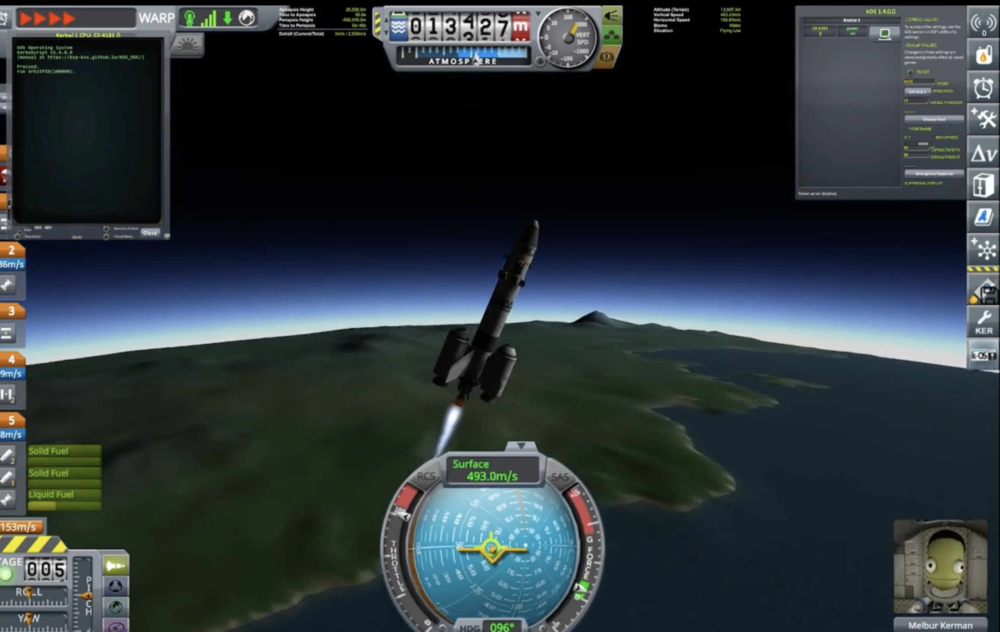

## Getting Started

To run the kOS scripts, you will need:

1.  **Kerbal Space Program (KSP):** Ensure you have the game installed.
2.  **kOS Mod:** Install the `kOS` mod for KSP. Instructions can usually be found on the kOS GitHub page or SpaceDock.
3.  **Place Scripts:** Copy the `.ks` files from the `kOS_scripts/` folder in this repository into the appropriate `kOS` script directory within your KSP installation (typically `GameData/kOS/Scripts/` or a subdirectory you've configured for kOS programs).
    * The `orbitPID.ks` script expects `maneuverFunctions.ks` to be available, usually by placing it in a `lib` folder relative to where `orbitPID.ks` is run, or by ensuring both are in the same kOS script path. The line `RUNONCEPATH("0:/lib/maneuverFunctions.ks")`  in `orbitPID.ks` indicates this dependency.

Once set up in KSP:
* Load a rocket in KSP.
* Open the kOS terminal in-game.
* **To set the desired orbit altitude, modify the `userAlt` parameter directly in the `orbitPID.ks` script:**
    ```kOS
    PARAMETER userAlt is 80000. // Change this value to your desired altitude in meters
    SET orbitAlt to userAlt - 4000.
    ```
* Run the main script (e.g., `RUN orbitPID.ks`).

## Results

The project successfully demonstrated autonomous orbiting of Kerbin. Initial tests used autopilot functions for data extraction, achieving stable orbits at 80 km with zero inclination[cite: 96, 97]. Subsequent development focused on equation-based control using "raw controls" instead of autopilot, which proved challenging due to kOS environment unfamiliarity and processing limitations, but ultimately achieved desired orbits. The achieved velocity was less than the maximum predicted velocity for the mission (3400 m/s from Delta-V map).

**Screenshots of successful missions:**
* 
* 

## Future Work

Potential future advancements for this project include:
* Refining the script's functionality and expanding its capabilities to handle more complex tasks, such as planetary landings.
* Investigating alternative mods or tools to enhance adaptability across diverse platforms and environments.
* Integrating the software with other simulation environments beyond KSP for extended testing and validation.
* Extending the script to enable the rocket to transition from a low Kerbin orbit to a different orbit, such as a geostationary orbit, requiring further refinement of algorithms and calculations. This expansion would significantly enhance the script's versatility and applicability, providing valuable insights into orbital mechanics and spacecraft navigation.


## License

This project is licensed under the Apache-2.0 License. See the `LICENSE` file for details.
